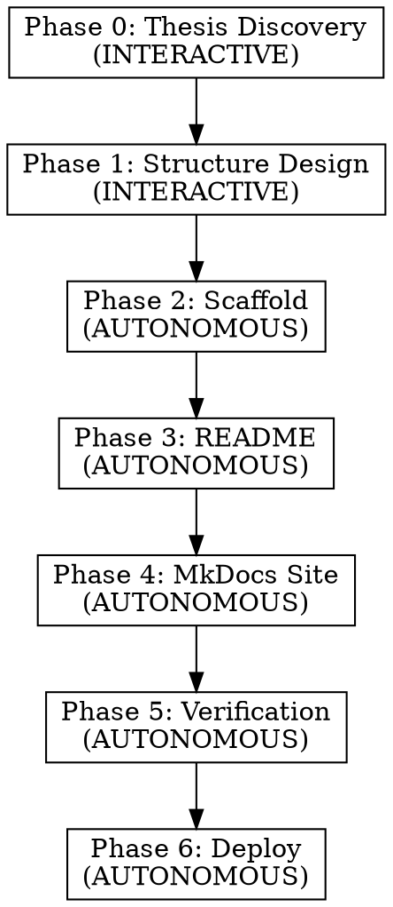

# Awesome List + Companion Site Builder

## Overview

Build a sindresorhus/awesome-compliant GitHub repo with a MkDocs Material companion site. The awesome list (README) provides the curated index; the site goes deeper with concept pages, method comparisons, deep reads, and synthesis essays.

**Core principle:** The list's value comes from its organizing thesis — the angle that makes it more than a link dump. Find the thesis before writing anything.

## When to Use

- Building a curated resource list for a research field or technical domain
- Creating a companion documentation site for a knowledge collection
- User says "awesome list", "curated list", "resource collection", or "knowledge repo"

## Pipeline



---

## Phase 0: Thesis Discovery (INTERACTIVE)

**Goal:** Find the organizing angle that makes this list worth reading.

**Do NOT skip this.** A list without a thesis is a link dump. The thesis determines the category structure, entry format, and what makes entries worth including.

**Ask the user:**
1. What is the field/topic?
2. What gap does this list fill? (What's missing from existing lists?)
3. What is the one sentence you'd put after the `>` in the README header?
4. Who is the target reader and what decision does this list help them make?

**Output:** A one-sentence thesis and a target reader profile.

**Examples of strong theses:**
- "Every method defines 'niche' differently — this list tells you how."
- "Foundation models promise to simulate cells but benchmarks say otherwise."
- "The field has 50 tools and no guide to which one answers your question."

**Red flag:** If the thesis is "a list of all X" — push back. Curation requires a point of view.

---

## Phase 1: Structure Design (INTERACTIVE)

**Goal:** Define categories, entry format, and MkDocs nav tree.

### 1a. Categories

Categories should reflect the thesis, not chronology or alphabetical grouping.

**Ask the user:**
- How should entries be grouped? (By method type, by problem solved, by input data, by output format?)
- Are there things that are commonly confused with the topic but are actually different? (These deserve their own section with an explicit "this is NOT X" note.)
- How many entries per category? (Target 3-8 per category, 40-60 total.)

### 1b. Entry Format

Standard awesome-list format with domain-specific tag:
```
- [Name](url) - [Optional tag:] One-sentence honest assessment (Journal, Year).
```

### 1c. MkDocs Nav Tree

Standard structure (adapt section names to domain):

```
docs/
├── index.md                    # Landing page
├── concepts/                   # 2-4 foundational "what is X" pages
│   ├── core-concept.md         # THE key page (matches thesis)
│   └── common-confusion.md     # "X vs Y" disambiguation
├── methods/                    # One page per category from 1a
├── deep-reads/                 # Paper analyses (5-15)
│   └── index.md
├── benchmarks/                 # State of evaluation
├── datasets/                   # Key datasets
├── synthesis/                  # Cross-cutting essays (1-3)
└── glossary.md
```

Optional domain-specific sections (hackathon, tutorials, getting-started).

### 1d. Coverage Seed

Ask the user for ~10 papers/tools they already know. Use these as seeds for coverage verification later.

**Output:** Category list, entry format, nav tree, seed list. Get user approval before proceeding.

---

## Phase 2: Scaffold (AUTONOMOUS)

**All files below are mechanical. Execute without asking.**

### File Checklist

| File | Source | Notes |
|------|--------|-------|
| `LICENSE` | CC0-1.0 full text | Required for awesome-list compliance |
| `code-of-conduct.md` | Contributor Covenant 2.0 | Set contact to user's email |
| `contributing.md` | Template below, adapt to topic | |
| `.gitignore` | `site/`, `__pycache__/`, `*.pyc`, `.DS_Store`, `.env` | |
| `requirements.txt` | `mkdocs-material>=9.5` | |
| `mkdocs.yml` | Template below, fill from Phase 1 | |
| `.github/workflows/ci.yml` | awesome-lint on PRs | |
| `.github/workflows/deploy-docs.yml` | mkdocs gh-deploy on push | |

### mkdocs.yml Template

```yaml
site_name: {SITE_NAME}
site_url: https://{GITHUB_USER}.github.io/{REPO_NAME}/
site_description: {THESIS}
repo_url: https://github.com/{GITHUB_USER}/{REPO_NAME}
repo_name: {GITHUB_USER}/{REPO_NAME}

theme:
  name: material
  palette:
    - scheme: default
      primary: teal
      accent: amber
      toggle:
        icon: material/brightness-7
        name: Switch to dark mode
    - scheme: slate
      primary: teal
      accent: amber
      toggle:
        icon: material/brightness-4
        name: Switch to light mode
  features:
    - navigation.tabs
    - navigation.sections
    - navigation.top
    - search.suggest
    - search.highlight
    - content.tabs.link
    - toc.integrate

extra_javascript:
  - https://hypothes.is/embed.js

plugins:
  - search
  - tags

markdown_extensions:
  - admonition
  - pymdownx.details
  - pymdownx.superfences
  - pymdownx.tabbed:
      alternate_style: true
  - tables
  - toc:
      permalink: true
  - attr_list
  - md_in_html

nav:
  # Fill from Phase 1c nav tree
```

### CI Workflows

**`.github/workflows/ci.yml`:**
```yaml
name: Lint
on:
  pull_request:
    branches: [main]
jobs:
  awesome-lint:
    runs-on: ubuntu-latest
    steps:
      - uses: actions/checkout@v4
      - uses: actions/setup-node@v4
        with:
          node-version: '20'
      - run: npx awesome-lint
```

**`.github/workflows/deploy-docs.yml`:**
```yaml
name: Deploy MkDocs
on:
  push:
    branches: [main]
    paths:
      - 'docs/**'
      - 'mkdocs.yml'
permissions:
  contents: write
jobs:
  deploy:
    runs-on: ubuntu-latest
    steps:
      - uses: actions/checkout@v4
      - uses: actions/setup-python@v5
        with:
          python-version: '3.12'
      - run: pip install mkdocs-material
      - run: mkdocs gh-deploy --force
```

### contributing.md Template

```markdown
# Contributing

Thank you for your interest in contributing to {SITE_NAME}.

## Adding an Entry

- Search existing entries to avoid duplicates.
- Each entry should link to an actively maintained project, paper, or resource.
- Use the format: `- [Name](url) - Description ending with a period.`
- Descriptions should be concise, objective, and explain why the resource is valuable.
- Add your entry to the appropriate section, in alphabetical order within that section.

## Quality Standards

We aim to curate the **best** resources, not all of them. Before submitting, ask:

- Is this resource actively maintained?
- Does it offer something unique compared to existing entries?
- Would a researcher entering this field benefit from knowing about it?

## Updating the Companion Site

If you want to contribute deeper content, please open an issue first to discuss scope.

## Reporting Issues

If you find a broken link or inaccuracy, please open an issue or submit a PR.
```

### Execution

```bash
# Create directories (adapt from Phase 1c nav tree)
mkdir -p .github/workflows docs/{concepts,methods,deep-reads,benchmarks,datasets,synthesis}

# Git init
git init -b main
git config user.name "{USER_NAME}"
git config user.email "{USER_EMAIL}"
```

---

## Phase 3: README (AUTONOMOUS)

Write the awesome list. Structure:

```markdown
# {TITLE} [](https://awesome.re)

> {THESIS}

{2-4 sentence introduction expanding the thesis.}

## Contents

{Auto-generated TOC linking to each section.}

## {Category 1}

{1-2 sentence description of what this category covers and how it relates to the thesis.}

- [Entry](url) - Honest one-sentence assessment (Journal, Year).
...

## Contributing

Contributions are welcome. Please read the [contribution guidelines](contributing.md) before submitting a pull request.
```

**Entry writing rules:**
- One sentence, honest, specific. Not marketing copy.
- Include limitations alongside strengths where notable.
- Journal and year in parentheses at end.
- Link to GitHub repo (not paper) when available; paper link in description.

---

## Phase 4: MkDocs Site (AUTONOMOUS)

Write all docs pages. Page types and templates:

### Concept Page Template
```markdown
# {Concept Name}

## The Short Answer
{1-2 sentences.}

## The Longer Answer
{Expanded explanation with historical context.}

## {Taxonomy / Classification / Types}
{The organizing structure — this is where the thesis lives.}

## Practical Guide
{Table: "If your question is X, use Y."}
```

### Methods Page Template (one per category)
```markdown
# {Category Name} Methods

**{Category}'s definition of [core concept]: {one sentence}.**

## Key Methods

### {Method Name}
- **Paper:** [Journal, Year](DOI)
- **Code:** [github.com/...](url)
- **{Concept} definition:** {How this method defines the core concept.}
- **Key innovation:** {What's new.}
- **Strengths:** {Honest.}
- **Limitations:** {Honest.}

## When to Use {Category} Methods

**Best for:** {bullet list}
**Not ideal for:** {bullet list}
```

### Deep Read Template
```markdown
# {Paper Short Name}

**Verdict:** {One sentence honest take.}

**Citation:** {Full citation with DOI link.}

## Problem Setup
{What question does the paper ask?}

## {Core Concept} Definition
{How does this paper define the core concept from the thesis?}

## Architecture / Method
{How does it work? Key design decisions.}

## Evaluation
{What was tested, how, against what baselines.}

## Honest Assessment

**Strengths:**
- {bullet list}

**Limitations:**
- {bullet list}

**Design Decision:** {The key bet this paper makes and why.}
```

### Other Pages
- **Benchmarks:** State of evaluation + what metrics matter.
- **Datasets:** Organized by what analysis types they support.
- **Synthesis:** Cross-cutting essays connecting themes across papers.
- **Glossary:** Key terms, ~15-25 entries.

---

## Phase 5: Verification (AUTONOMOUS)

### 5a. Coverage Audit

Use 4 independent sources to find gaps:

| Source | How to Check | What It Tells You |
|--------|-------------|-------------------|
| **Benchmark papers** | Web search for major benchmarks in the field; list all methods tested | Methods the field considers competitive |
| **Existing awesome lists** | Search GitHub for `awesome-{topic}`; compare entries | Community-validated selections |
| **Review papers** | Check method tables in 2-3 recent reviews | Domain expert landscape view |
| **Citation counts** | For each category, verify top-3 most-cited are included | What researchers actually use |

**Process:** Dispatch a subagent to run the audit. It should return:
1. Methods found elsewhere that we're missing (with add/skip recommendation)
2. Methods we include that may be miscategorized
3. Citation or venue errors
4. Overall coverage percentage per category

**Target:** ≥85% coverage of Tier 1 methods (published in top venue + benchmarked + maintained codebase).

### 5b. Fix Gaps

Apply audit findings: add missing methods, fix categorization errors, correct citations.

### 5c. Privacy Grep

Before any push:
```bash
grep -ri "my plan\|my approach\|I would\|my strategy\|your career\|your PI" docs/ README.md
```
Remove any first-person or strategy language.

---

## Phase 6: Deploy (AUTONOMOUS)

```bash
# Stage, commit, push
git add -A
git commit -m "Initial commit: awesome list + MkDocs companion site"

# Create GitHub repo
gh repo create {GITHUB_USER}/{REPO_NAME} --public \
  --description "{THESIS}" --source=. --push

# Add topics
gh repo edit {GITHUB_USER}/{REPO_NAME} \
  --add-topic awesome-list --add-topic awesome \
  --add-topic {topic1} --add-topic {topic2}

# Enable GitHub Pages (serve from gh-pages branch)
gh api repos/{GITHUB_USER}/{REPO_NAME}/pages -X POST \
  -f "build_type=legacy" -f "source[branch]=gh-pages" -f "source[path]=/"

# If Pages was auto-created with workflow mode, fix it:
gh api repos/{GITHUB_USER}/{REPO_NAME}/pages -X PUT \
  -f "build_type=legacy" -f "source[branch]=gh-pages" -f "source[path]=/"

# Trigger initial build
gh api repos/{GITHUB_USER}/{REPO_NAME}/pages/builds -X POST

# Verify
gh api repos/{GITHUB_USER}/{REPO_NAME}/pages/builds/latest \
  --jq '{status, error: .error.message}'
```

**GitHub Pages gotcha:** `mkdocs gh-deploy --force` pushes to the `gh-pages` branch. Pages must be configured for `legacy` build type with `gh-pages` as source branch. If set to `workflow` mode, the site will 404.

---

## Inline Review with Hypothesis

The mkdocs.yml template includes [Hypothesis](https://web.hypothes.is/) for inline text annotation — select any word or sentence on the deployed site and leave a comment, just like in Google Docs or Word.

**How it works:**
1. Visit any page on the deployed companion site
2. Select text → click "Annotate" in the tooltip
3. Type your comment (first time requires a free Hypothesis account)
4. Set visibility to "Only Me" for private review notes

**Checking annotations programmatically:**
```bash
# Fetch all public annotations for a page
curl -s "https://hypothes.is/api/search?uri=https://{GITHUB_USER}.github.io/{REPO_NAME}/{page}/" | python3 -m json.tool
```

**When to use:** After Phase 6 deploy, review the live site page by page. Hypothesis annotations serve as inline TODO items — "reword this", "add citation", "verify claim" — anchored to the exact text that needs attention.

**To remove:** Delete the `extra_javascript` line from `mkdocs.yml` and redeploy. No content is affected.

---

## Common Mistakes

| Mistake | Fix |
|---------|-----|
| No thesis — list is just links | Go back to Phase 0. Every list needs a point of view. |
| Categories mirror chronology | Reorganize by the thesis dimension (method type, problem solved, etc.) |
| Entry descriptions are marketing copy | Rewrite with honest assessment including limitations |
| Too many entries (100+) | Curate harder. 40-60 is the sweet spot. |
| MkDocs pages repeat the README | README = index, site = depth. Deep reads and synthesis essays add value the README can't. |
| GitHub Pages 404 after deploy | Check `build_type` is `legacy` and source branch is `gh-pages` |
| awesome-lint fails | Ensure: badge in h1, TOC present, contributing section present, CC0 license |
| Coverage gaps in one category | Run verification audit (Phase 5a) |

## Quick Reference

| Phase | Interactive? | Time Est. | Output |
|-------|-------------|-----------|--------|
| 0: Thesis | Yes | 5-10 min conversation | One-sentence thesis |
| 1: Structure | Yes | 10-15 min conversation | Categories + nav tree |
| 2: Scaffold | No | 2 min | Boilerplate files |
| 3: README | No | ~40-60 entries | Awesome list |
| 4: Site | No | ~15-30 pages | MkDocs content |
| 5: Verify | No | Subagent audit | Coverage report + fixes |
| 6: Deploy | No | 2 min | Live repo + site |
